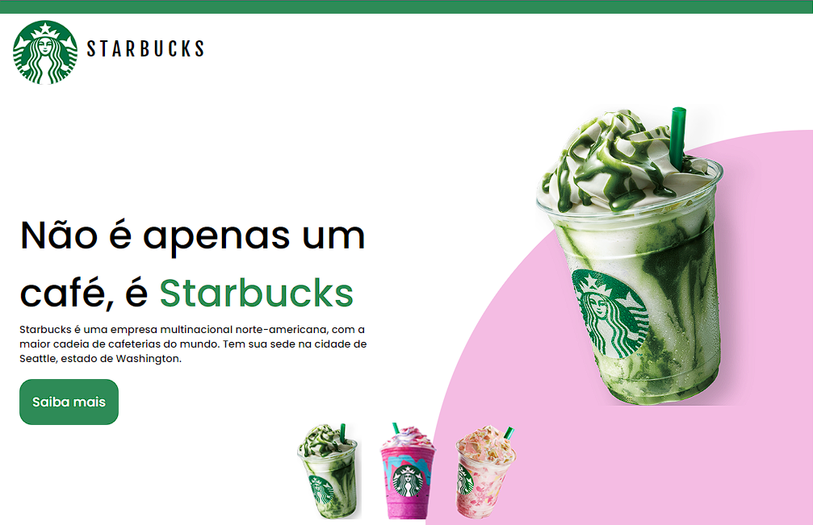

<h1 align="center"> Starbucks </h1>

 

  

## 💻 Projeto

"Starbucks" é um projeto de website que está sendo desenvolvido por mim, e que ainda não está totalmente finalizado. Não é nada oficial, é apenas uma atividade para aprimorar os meus conhecimentos na programação. 

- [Acessar projeto]()

## 🚀 Tecnologias

Foi desenvolvido com as seguintes tecnologias:

- HTML e CSS
- JavaScript
- Git e Github
